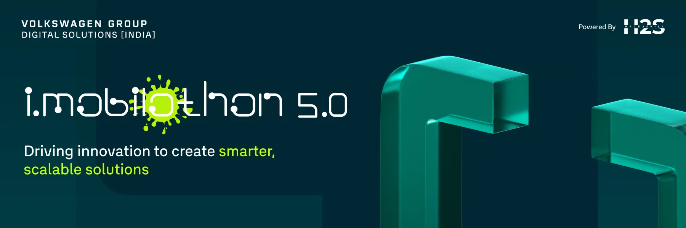

### The Challenge & Our Solution

The modern urban commute is a fragmented, stressful experience. Drivers waste fuel and time endlessly circling blocks, hunting for elusive parking spots. Commuters are forced to juggle multiple apps—one for ride-hailing, another for parking, and yet another for payments.

**TechWagon is our answer.**

Born from the **Volkswagen Imobilothon 5.0**, TechWagon is a single, cohesive ecosystem designed to solve this problem. We integrate AI-powered smart parking prediction, seamless booking, and on-demand ride-sharing into one intuitive platform. Our mission is to deliver a frictionless mobility experience, replacing app-juggling with a single, intelligent solution.

### Strategic Alignment with Volkswagen Group

TechWagon is more than a convenience app; it's a direct answer to the Volkswagen Group's core strategic goals for a digital and sustainable future.

* **Sustainability & Smart City:** By reducing the time drivers spend "circling the block," our AI-powered prediction model directly reduces fuel consumption, vehicle emissions, and urban congestion.
* **Digital Ecosystems:** This project supports the shift from a traditional automaker to a comprehensive mobility provider by creating a single, scalable ecosystem that integrates the vehicle (CarPlay), the driver (app), and urban infrastructure (parking garages).
* **Scalable Solutions:** The microservice architecture (Node.js, Python, PostgreSQL) is built for scale, allowing it to be deployed as a "plug-and-play" solution for any city, mall, or corporate campus.

-----

### Our Vision in Action

We invite you to see our fully functional prototype. Watch our demo video for a complete user walkthrough and review our technical presentation for a deep dive into the architecture.

**Demo Video:** [https://youtu.be/Dyze56q51fk](https://youtu.be/Dyze56q51fk)

> ### [View Our Technical Presentation (PDF)](TechWagon.pdf)
>
> **Click above for a detailed breakdown of our system architecture, business model, and the core technology that powers TechWagon.**

-----

### Project Deep Dive: Features & Architecture

> **For a complete technical breakdown, including API specs and database schema, see our [ARCHITECTURE.md](ARCHITECTURE.md) file.**

TechWagon is not a single application but a sophisticated system of interconnected services.

#### 1\. The User Experience (React Native Mobile App)

The entire platform is anchored by a single, cross-platform mobile app for both iOS and Android.

  * **Unified Interface:** Users manage both ride-sharing and parking from one dashboard.
  * **Smart Parking Flow:**
    1.  **Discover:** Users see a real-time map of parking lots, color-coded by availability predicted by our AI.
    2.  **Predict:** Users can select a future arrival time, and our ML model forecasts the likely availability, allowing for advance planning.
    3.  **Book & Pay:** The user selects a spot, books it, and pays seamlessly via the integrated **Stripe** wallet.
    4.  **Navigate:** The app provides turn-by-turn navigation directly to the parking garage entrance.
    5.  **Enter/Exit:** The user's license plate is their "ticket." Our CV system (see below) recognizes their plate and opens the barrier automatically.
  * **Ride-Sharing Flow:**
    1.  **Book:** A familiar, "Uber-like" interface lets users set a destination, see a fare estimate, and book a ride.
    2.  **Track:** Users can see their driver's location in real-time on the map.
    3.  **Pay:** The ride is automatically charged to their in-app Stripe wallet upon completion.
  * **Integrated Wallet:** A single, secure wallet manages funds for all services, allowing users to add funds once and spend on either parking or rides.
  * **CarPlay Integration:** Key features like navigation and ride status are safely accessible from the vehicle's built-in dashboard.

#### 2\. The AI Core (Machine Learning Service)

This is a dedicated Python microservice responsible for "parking prediction."

  * **Function:** It exposes an API endpoint that the main backend can query. The query asks, "What is the predicted parking availability for Lot X at Time Y?"
  * **Training:** The model (`parking_model_v2.joblib`) was trained using **Scikit-learn** on a synthetic dataset (created in `Syn-Dataset.ipynb`) that mimics real-world parking patterns (e.g., peak hours, weekdays vs. weekends, local events).
  * **Output:** The service returns a probability or a percentage of availability, which the mobile app translates into simple-to-understand labels like "High," "Medium," or "Low" availability.

#### 3\. The Vision System (Computer Vision Service)

This standalone Python service (`CV_VW/`) automates parking garage access.

  * **Function:** It is designed to run on a small computer (like a Raspberry Pi) connected to cameras at a garage's entry and exit points.
  * **Process (ANPR):**
    1.  A camera detects motion and captures an image of a vehicle's license plate.
    2.  The Python script (using **OpenCV**) performs image processing to isolate and read the plate characters (Automatic Number Plate Recognition - ANPR).
    3.  It sends the recognized plate number (e.g., "MH12AB3456") to the main backend API.
    4.  The backend checks: "Does this plate have an active booking *right now*?"
    5.  If yes, the backend sends an "OK" response, and the CV service triggers the physical barrier to open.

#### 4\. The Central Nervous System (Node.js Backend)

This is the core **TypeScript API** that orchestrates the entire platform.

  * **Role:** It is the single source of truth. The mobile app, the AI service, and the CV service *all* communicate with this backend.
  * **Key Responsibilities:**
      * **State Management:** Manages the real-time status of every parking spot (e.g., "Available," "Booked," "Occupied").
      * **User & Auth:** Securely manages user accounts, profiles, and login sessions using **Clerk** authentication.
      * **Payment Processing:** Integrates directly with the **Stripe API** to handle all transactions, manage the wallet, and process payouts to drivers or lot owners.
      * **Logic Hub:** Contains all the business logic—calculating ride fares, verifying parking bookings from the CV service, and validating user actions.
      * **Database Interface:** Uses **Prisma ORM** for safe and efficient communication with our **PostgreSQL** database.

#### 5\. The Command Center (Admin Dashboard)

This is a separate web application that allows administrators to manage the entire ecosystem.

  * **Function:** Provides a god-mode view of the platform.
  * **Capabilities:**
      * **Analytics:** View real-time revenue from both parking and rides.
      * **User Management:** Manage user accounts, handle support requests, or ban fraudulent users.
      * **Driver Verification:** Onboard new drivers by verifying their documents and vehicle information.
      * **Parking Management:** Manually override parking barriers, view occupancy statistics, and manage parking lot pricing.

